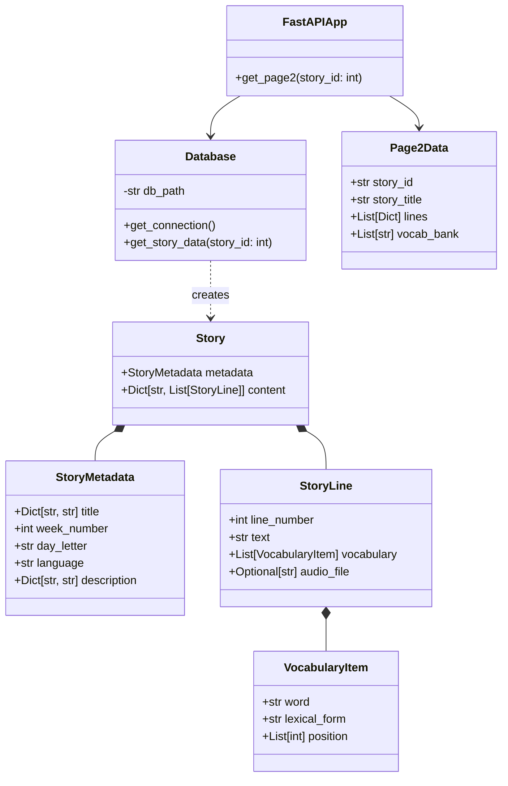
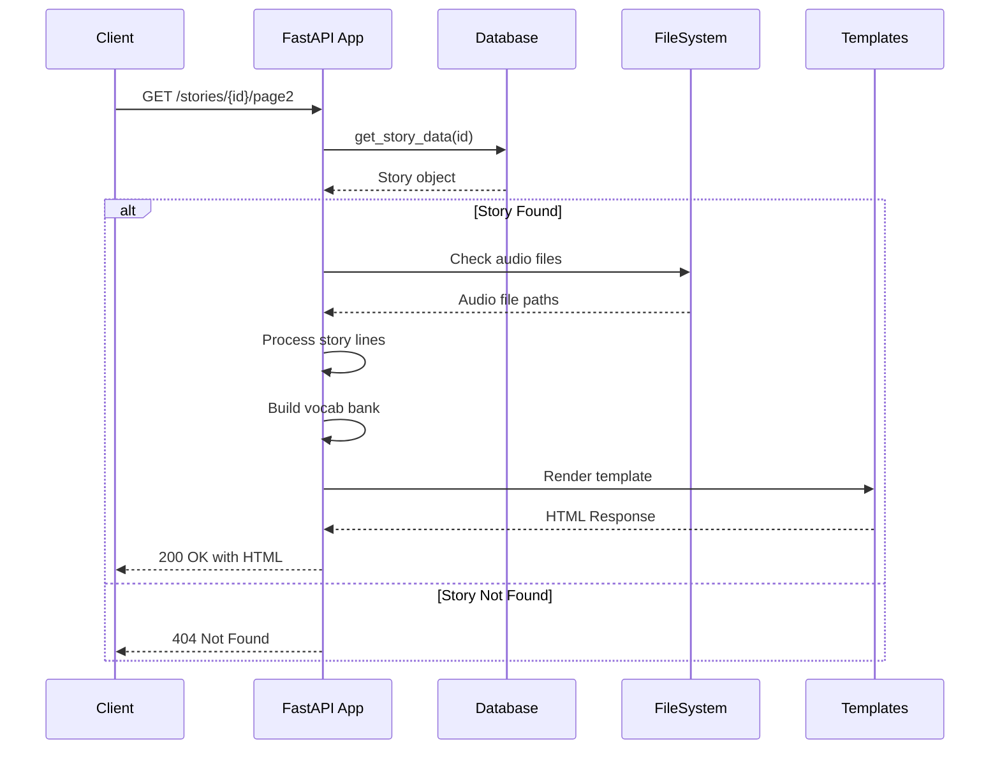

# This folder contains the files served by the python code.

TODO: These have not been checked for accuracy.

## Class diagram

```mermaid
classDiagram
    class Story {
        +StoryMetadata metadata
        +Dict[str, List[StoryLine]] content
    }

    class StoryMetadata {
        +Dict[str, str] title
        +int week_number
        +str day_letter
        +str language
        +Dict[str, str] description
    }

    class StoryLine {
        +int line_number
        +str text
        +List[VocabularyItem] vocabulary
        +Optional[str] audio_file
    }

    class VocabularyItem {
        +str word
        +str lexical_form
        +List[int] position
    }

    class Database {
        -str db_path
        +get_connection()
        +get_story_data(story_id: int)
    }

    class Page2Data {
        +str story_id
        +str story_title
        +List[Dict] lines
        +List[str] vocab_bank
    }

    class FastAPIApp {
        +get_page2(story_id: int)
    }

    Story *-- StoryMetadata
    Story *-- StoryLine
    StoryLine *-- VocabularyItem
    FastAPIApp --> Database
    FastAPIApp --> Page2Data
    Database ..> Story : creates
```
### SequenceDiagram

```mermaid
sequenceDiagram
    participant C as Client
    participant A as FastAPI App
    participant D as Database
    participant F as FileSystem
    participant T as Templates

    C->>A: GET /stories/{id}/page2
    A->>D: get_story_data(id)
    D-->>A: Story object

    alt Story Found
        A->>F: Check audio files
        F-->>A: Audio file paths
        A->>A: Process story lines
        A->>A: Build vocab bank
        A->>T: Render template
        T-->>A: HTML Response
        A-->>C: 200 OK with HTML
    else Story Not Found
        A-->>C: 404 Not Found
    end
```
